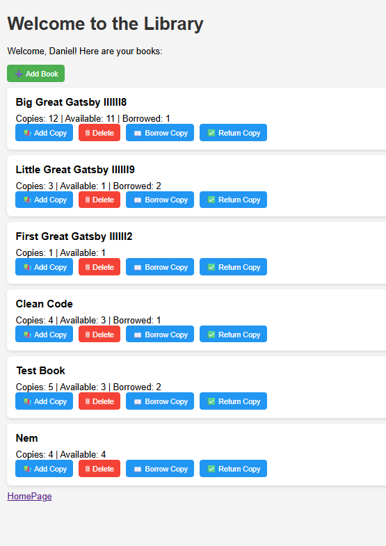
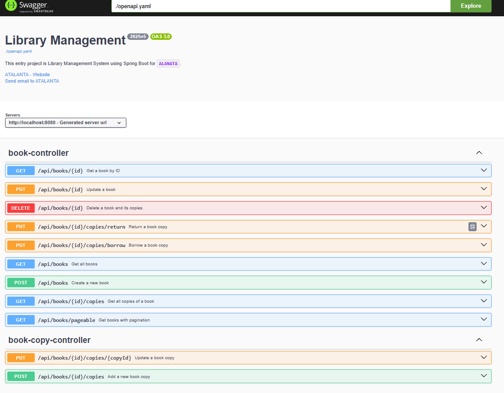
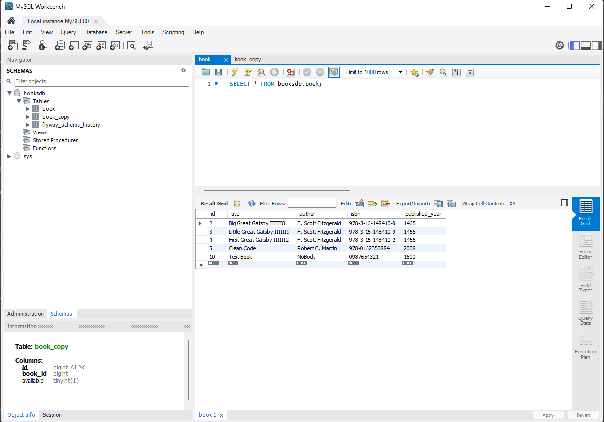
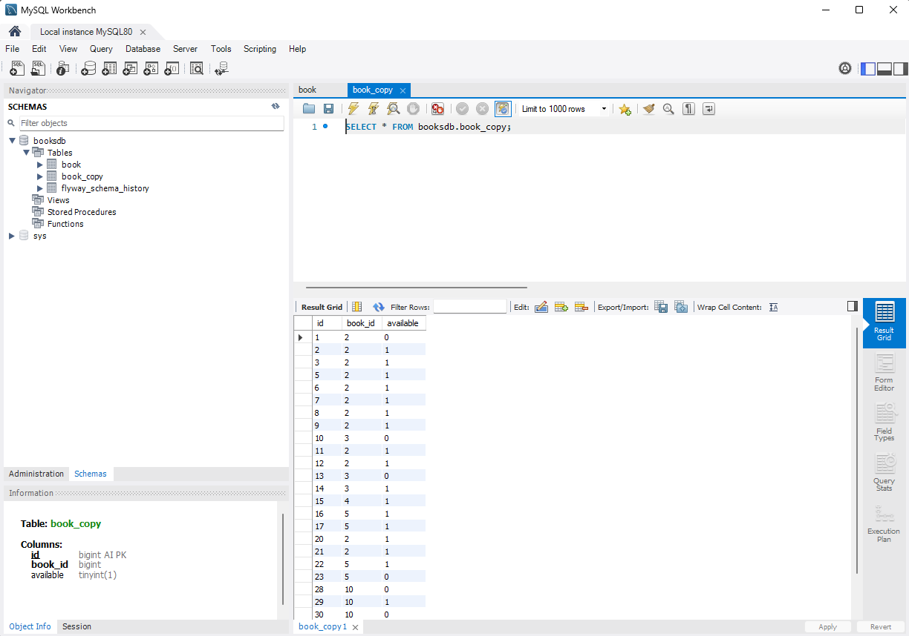

# Simple Library Management System

This project is a **Simple Library Management System** implemented using **Spring Boot**. It provides a RESTful
API to manage books and their copies, allowing users to perform CRUD operations and track availability of each book
copy.

### Prerequisites

- Java 17 or higher
- Maven 3.6+
- IDE of your choice (IntelliJ IDEA, Eclipse, VS Code, etc.)
- Docker Desktop:
  Docker is required for running Mysql database,Swagger-API and Testcontainers during testing.
  [https://www.docker.com/products/docker-desktop](https://www.docker.com/products/docker-desktop)  choice for your OS

## 🔨 Run the App

### 1.Steps to Run the Application in terminal

1. Install and after Run <b>Docker Desktop</b>. Here is the installation <b>
   link</b> : https://docs.docker.com/docker-for-windows/install/

2. Clone the repository:
   ```bash
   git clone https://github.com/DanielSan2023/library
    ```
3. Go to the project's home directory:
   ```bash
   cd library
   ```
4. Build the project and create a jar file:
   ```bash
   mvn clean install  
    ```
5. Run the application:
   ```bash
   mvn spring-boot:run
   ```
6. Access the application:
    - Swagger UI: [http://localhost:8081](http://localhost:8081)
    - MySQL:  (use MySQL Workbench or any other client to connect localhost:3306)
      Username: `user` Password: `root` and Database name: `booksdb`
    - Postman Collection: [library.postman_collection.json](src/main/resources/library.postman_collection.json) file
      import to Postman
    - Thymeleaf: [http://localhost:8080](http://localhost:8080)


7. Run the tests: Note: Before running tests, stop the application if it's running, because tests use Testcontainers
   which manage Docker containers and can conflict with the running app.

```bash
   mvn test
   ```  

### 2.Steps to Run the Application in IDE for instance IntelliJ IDEA

1. Install and after Run <b>Docker Desktop</b>. Here is the installation <b>
   link</b> : https://docs.docker.com/docker-for-windows/install/
2. Run IntelliJ IDEA .

3. Clone the repository:
    ```bash
   git clone https://github.com/DanielSan2023/library
    ```
4. Open the project in IntelliJ IDEA.

5. Open the terminal in IntelliJ IDEA and run the following command to build the project:
    ```bash
   mvn clean install  
    ```
6. Run the application.

Note: Before running tests, stop the application if it's running, because tests use Testcontainers which manage Docker
containers and can conflict with the running app.

📦 MySQL-Docker Container – Table Design

🧾 Book Table Schema

| Attribute        | Type    | Notes                                                        |
|------------------|---------|--------------------------------------------------------------|
| `id`             | Long    | Primary key. Auto-generated unique identifier for a book.    |
| `title`          | String  | Not null. Unique title of the book.                          |
| `author`         | String  | Not null. Name of the author.                                |
| `isbn`           | String  | Not null. Unique ISBN. Must follow standard ISBN format.     |
| `published_year` | Integer | Not null. Must be a valid year (e.g., between 1450 and now). |

🧾 BookCopy Table Schema

| Attribute   | Type    | Notes                                                                |
|-------------|---------|----------------------------------------------------------------------|
| `id`        | Long    | Primary key. Auto-generated unique identifier for a book copy.       |
| `book_id`   | Long    | Not null. Foreign key referencing `Book(id)`.                        |
| `available` | Boolean | Not null. Indicates if the copy is available. Default value: `true`. |

## Flyway migration create booksdb database

<details>
  <summary>Create Table "book"...</summary>

```sql
CREATE TABLE IF NOT EXISTS book
(
    id             BIGINT AUTO_INCREMENT PRIMARY KEY,
    title          VARCHAR(255) NOT NULL UNIQUE,
    author         VARCHAR(255) NOT NULL,
    isbn           VARCHAR(255) NOT NULL UNIQUE,
    published_year INT          NOT NULL
);
```

</details>
<details>
  <summary>Create Table "bookCopy"...</summary>

```sql
CREATE TABLE IF NOT EXISTS book_copy
(
    id        BIGINT AUTO_INCREMENT PRIMARY KEY,
    book_id   BIGINT     NOT NULL,
    available TINYINT(1) NOT NULL DEFAULT 1,
    CONSTRAINT fk_book_copy_book FOREIGN KEY (book_id) REFERENCES book (id)
);
```

</details>


📘 Data Flow – Library Management System
📂 Controller

| Controller           | Methods                                                                                                                                                                                                                                                                                                                                                                                                                                                                                                                                                |
|----------------------|--------------------------------------------------------------------------------------------------------------------------------------------------------------------------------------------------------------------------------------------------------------------------------------------------------------------------------------------------------------------------------------------------------------------------------------------------------------------------------------------------------------------------------------------------------|
| `BookController`     | - `getAllBooks`: Retrieve a list of all books.<br/> - `createBook`: Create a new book.<br/> - `getBookById`: Retrieve detailed book information by ID.<br/> - `updateBook`: Update an existing book by ID.<br/> - `deleteBook`: Delete a book and its copies by ID.<br/> - `getAllBookCopies`: Retrieve all copies of a specific book.<br/> - `getBooksPageable`: Get a paginated and optionally sorted list of books.<br/> - `borrowBookCopy`: Mark one copy of the book as borrowed.<br/> - `returnBookCopy`: Mark one copy of the book as returned. |
| `BookCopyController` | - `addCopyToBook`: Add a new physical copy to an existing book.<br/> - `updateBookCopyAvailability`: Update the availability status of a specific book copy.                                                                                                                                                                                                                                                                                                                                                                                           |

🧠 Service

| Service           | Methods                                                                                                                                                                                                                                                                                                                                                                                                                                                              |
|-------------------|----------------------------------------------------------------------------------------------------------------------------------------------------------------------------------------------------------------------------------------------------------------------------------------------------------------------------------------------------------------------------------------------------------------------------------------------------------------------|
| `BookService`     | - `getAllBooks`: Retrieve all books from the database.<br/> - `createBook`: Validate and create a new book.<br/> - `getBookById`: Retrieve book by ID.<br/> - `updateBook`: Validate and update an existing book.<br/> - `deleteBook`: Delete a book by ID.<br/> - `getCopiesByBookId`: Retrieve all copies for a book.<br/> - `getPageBooks`: Retrieve paginated list of books.<br/> - `updateBookCopyAvailability`: Borrow or return a copy based on availability. |
| `BookCopyService` | - `addCopyToBook`: Create a new book copy and assign it to a book.<br/> - `updateAvailability`: Update the availability status (borrow/return) of a book copy.                                                                                                                                                                                                                                                                                                       |

🗃️ Repository

| Repository           | Responsibilities                                                                                                                                                   |
|----------------------|--------------------------------------------------------------------------------------------------------------------------------------------------------------------|
| `BookRepository`     | - `findAll`, `findById`, `save`, `deleteById`: CRUD operations for books.<br/> - `existsByTitle`, `existsByIsbn`: Used for validation to check for duplicates.     |
| `BookCopyRepository` | - `save`: Create or update a book copy.<br/> - `findById`: Retrieve a specific book copy.<br/> - Additional custom methods as needed for managing copies of books. |

✅ Technologies Used

| Category                | Technology & Tools                               | Description                                                                                                                                                                                                                            |
|-------------------------|--------------------------------------------------|----------------------------------------------------------------------------------------------------------------------------------------------------------------------------------------------------------------------------------------|
| **Architecture**        | Microservices                                    | Architectural style where the application is composed of small, loosely coupled, independently deployable services, each responsible for a specific business capability. Enables scalability, fault isolation, and ease of deployment. |
| **Design Pattern**      | Spring MVC (Model-View-Controller)               | Each microservice follows MVC pattern to separate concerns and promote maintainability.                                                                                                                                                |
| **Framework**           | Spring Boot 3.4.5                                | Backend framework for building RESTful APIs and web applications.                                                                                                                                                                      |
| **Language**            | Java 17                                          | Modern, stable Java version with long-term support.                                                                                                                                                                                    |
| **Database**            | MySQL 8.0                                        | Relational database for application data storage.                                                                                                                                                                                      |
| **Database Migration**  | Flyway (v11.8.2)                                 | Manages database schema migrations and versioning.                                                                                                                                                                                     |
| **Build Tool**          | Maven                                            | Project management and build automation tool.                                                                                                                                                                                          |
| **API Documentation**   | Swagger OpenAPI (springdoc-openapi) + Swagger UI | Auto-generated REST API docs with interactive Swagger UI interface.                                                                                                                                                                    |
| **Frontend Templating** | Thymeleaf (v3.0.x)                               | Server-side HTML templating engine for rendering dynamic web pages.                                                                                                                                                                    |
| **API Testing**         | Postman, Swagger UI ,Thymeleaf                   | Tool for testing and interacting with API endpoints.                                                                                                                                                                                   |
| **Email Handling**      | JavaMail API                                     | Sending and handling emails within the application.                                                                                                                                                                                    |
| **Validation**          | Jakarta Validation API, Spring Boot Validation   | Validates user input and data integrity.                                                                                                                                                                                               |
| **Object Mapping**      | ModelMapper (v3.2.3)                             | Maps between DTOs and domain entities.                                                                                                                                                                                                 |
| **Unit Testing**        | JUnit (via Spring Boot Starter Test)             | Unit and integration testing framework.                                                                                                                                                                                                |
| **Mocking Framework**   | Mockito (v5.17.0)                                | Mocking dependencies for testing purposes.                                                                                                                                                                                             |
| **Test Containers**     | Testcontainers (v1.21.0)                         | Provides containerized database instances for integration tests.                                                                                                                                                                       |
| **Lombok**              | Lombok (v1.18.38)                                | Annotation-based boilerplate reduction in Java code.                                                                                                                                                                                   |
| **Compression Utility** | Apache Commons Compress (v1.27.1)                | Utilities for compressing and decompressing files.                                                                                                                                                                                     |
| **Containerization**    | Docker & Docker Compose (v3.8)                   | Docker containers used for MySQL and Swagger UI for local development.                                                                                                                                                                 |

## 🛠️ Planned Enhancements & Feature Branches

This project is actively being developed by me. Below are some planned features that will be implemented in future
versions. Each major feature will have its own dedicated Git branch for focused development and testing.

### Planned Features

- 🔍 **Improve Logging & Exception Handling**
    - Add global exception handling and structured logging.
    - 🔄 Branch: `feature/logging-enhancement`

- 🔐 **HTTPS Configuration**
    - Add SSL support to secure endpoints.
    - 🔄 Branch: `feature/https-support`

- 🛡️ **JWT Authentication & Role-Based Access**
    - Use Spring Security with JWT tokens.
    - Implement user roles like `ADMIN` and `USER`.
    - 🔄 Branch: `feature/jwt-auth`

- 🚀 **CI/CD with GitHub Actions**
    - Set up GitHub Actions for:
    - Build and test on push and pull requests
    - 🔄 Branch: `feature/github-actions-cicd`

- 🐳 **Dockerized Spring Boot Application**
    - Add `Dockerfile` to package the app as a container.
    - 🔄 Branch: `feature/dockerize-app`

- ☁️ **Deploy to Cloud**
    - Prepare the project for deployment on Heroku, AWS, or Azure.
    - 🔄 Branch: `feature/cloud-deployment`

## 📚 Documentation and Resources

### 🌐 Useful Articles and References

- [Spring Initializr – Start Your Project](https://start.spring.io/)
- [ModelMapper – Map Entity to DTO (GeeksforGeeks)](https://www.geeksforgeeks.org/spring-boot-map-entity-to-dto-using-modelmapper/)
- [Integration Testing with Testcontainers – AtomicJar](https://www.testcontainers.org/)
- [Integration Tests with Testcontainers and Spring Boot 3.1+ (Medium)](https://medium.com/@alekskolata/integration-tests-with-testcontainers-and-spring-boot-3-1-8e5f1a90e9c6)
- [Documenting a Spring REST API Using OpenAPI 3.0 (Baeldung)](https://www.baeldung.com/spring-rest-openapi-documentation)

## License

This project is provided for demonstration and learning purposes.

## Contact

For any questions, please contact:  
[Daniel](mailto:electronic.san@gmail.com)

### 📸 Screenshots

<details>
<summary>Click here to show the screenshots of the project</summary>

#### 🏠 Figure 1: Thymeleaf Home Page


#### 📚 Figure 2: Thymeleaf Books Page



#### 📘 Figure 3: Swagger Library API



#### 🛢️ Figure 4: MySQL Book Table



#### 📄 Figure 5: MySQL BookCopy Table



</details>
